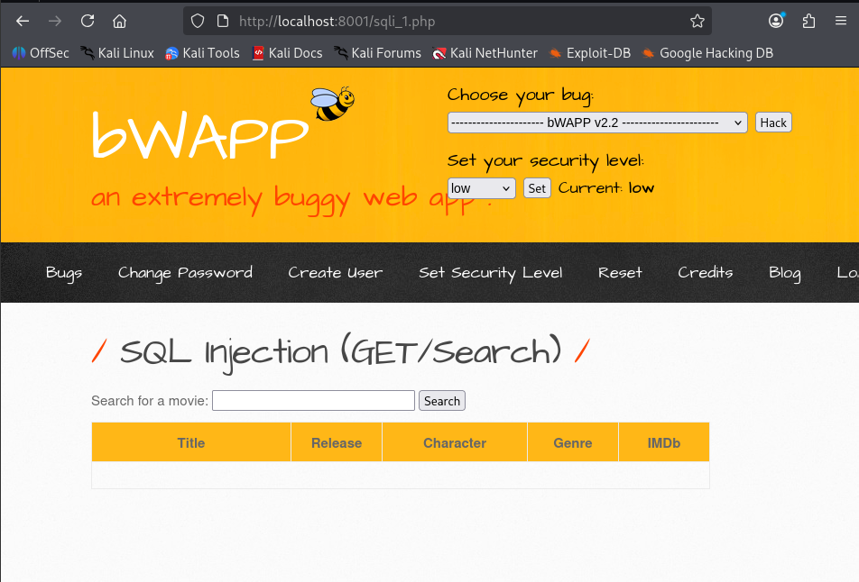
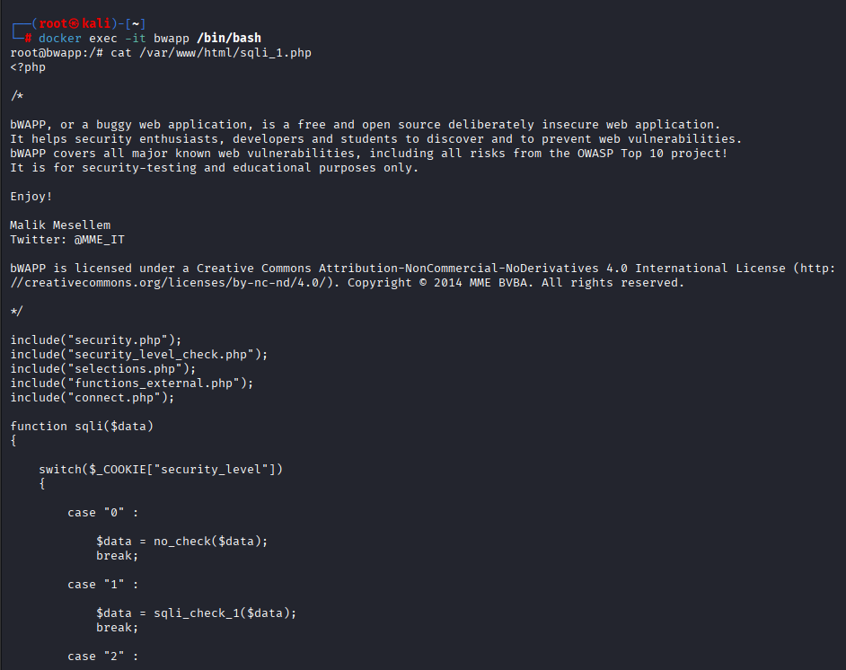

# Puesta en Producción Segura – Máquinas Vulnerables (bWAPP)
---


*En este caso SQLi (sqli_1.php), realizaremos la inspección del código para mostrar claramente cómo la aplicación trata el input del usuario y por qué es vulnerable.*

---

**Entramos al contenedor y visualizamos el código del archivo**
---


---


## Entrada de datos (input)

La aplicación recibe el input directamente desde la URL:

``` php
if(isset($_GET["title"]))
{
    $title = $_GET["title"];
```


**Conclusión:**
El parámetro title proviene directamente de $_GET, es decir, entrada controlada por el usuario sin validación inicial.

## Uso del input en la consulta SQL

Ese valor se utiliza para construir una consulta SQL:

```php 
$sql = "SELECT * FROM movies WHERE title LIKE '%" . sqli($title) . "%'";
```

**Conclusión:**

El input del usuario se concatena directamente en la consulta SQL. Esto es una mala práctica y la base del SQL Injection.

## Función intermedia sqli()

Antes de llegar a la consulta, el input pasa por esta función:

```php 
function sqli($data)
{
    switch($_COOKIE["security_level"])
    {
        case "0":
            $data = no_check($data);
            break;

        case "1":
            $data = sqli_check_1($data);
            break;

        case "2":
            $data = sqli_check_2($data);
            break;

        default:
            $data = no_check($data);
    }
    return $data;
}
```
---


**Conclusión clave:**

El tratamiento del input depende del nivel de seguridad configurado en bWAPP (cookie security_level).

## Comportamiento según nivel de seguridad

**Nivel 0 – Inseguro**

```php
$data = no_check($data);
```

- No hay validación ni filtrado

- El input llega tal cual a la consulta SQL

- SQL Injection completamente posible

**Nivel 1 – Protección débil**
```php
$data = sqli_check_1($data);
```

- Filtros básicos (normalmente eliminación de comillas o palabras clave)

- Protección insuficiente

- SQLi aún posible con técnicas ligeramente adaptadas

**Nivel 2 – Protección mayor (pero no perfecta)**

```php
$data = sqli_check_2($data);
```

- Más controles y escapes

- Reduce ataques básicos

- Sigue sin usar consultas preparadas

**Ejecución final de la consulta**

```php
$recordset = mysql_query($sql, $link);
```

- Problemas adicionales:

- Uso de mysql_query() (obsoleto)

- No hay consultas preparadas

- No hay binding de parámetros

- No hay separación entre lógica y datos

## Resumen del código:

- La aplicación confía en el input del usuario
- Construye consultas SQL por concatenación de strings
- La seguridad depende de filtros manuales
- No usa PDO ni mysqli con prepared statements
- Diseño inseguro para un entorno de producción

## Enfoque de Producción Segura (qué deberíamos hacer)

En un entorno real, el código debería:

- Usar consultas preparadas

- Validar y sanear input antes de usarlo

- No depender del “nivel de seguridad” para proteger la base de datos

- Eliminar completamente funciones mysql_*